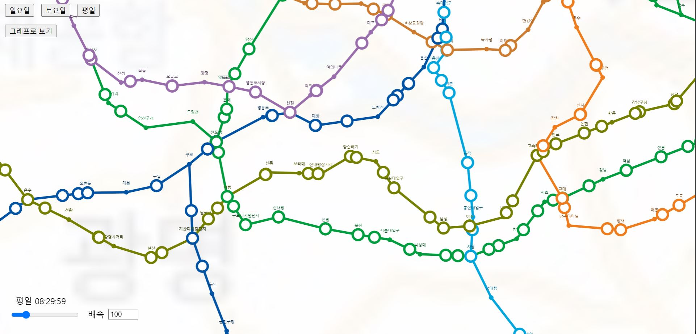

# SeoulTrainMap
---

Map displaying seoul's train movement.

Using train schedule I got from [here](http://data.seoul.go.kr/dataList/OA-101/A/1/datasetView.do;jsessionid=70D4E336B03B380FC423BE6005731652.new_portal-svr-11).

Open with any static server you have.

***Don't use this to check when your train will arrive irl.*** Not only is it ouddated, it's base on supposed train schedule rather than a real time data.

# 서울시 지하철 지도
---

서울시의 지하철 운행을 표시하는 지도입니다.

[서울 열린 데이터 광장](http://data.seoul.go.kr/dataList/OA-101/A/1/datasetView.do;jsessionid=70D4E336B03B380FC423BE6005731652.new_portal-svr-11)에서 받은 지하철 시간표를 이용해 만들었습니다.

그냥 static server 아무거나 써서 돌리세요.

***실생활에서 지하철이 언제 올지 확인하는데 쓰지 마세요!*** 데이터가 오래 됬을 뿐만 아니라 지하철 시간표이기 때문에 실제로 언제 올지랑을 다를 수 도 있습니다.
